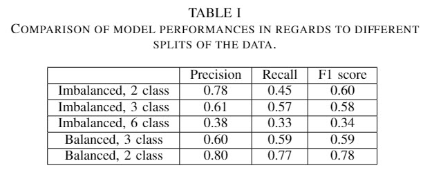
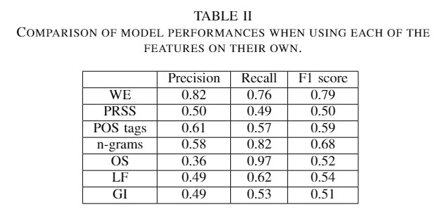
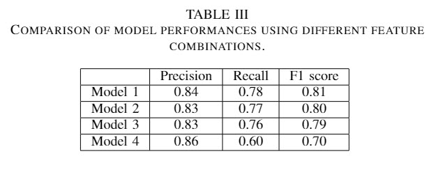
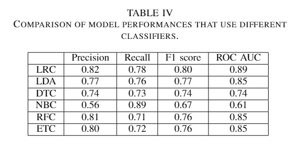
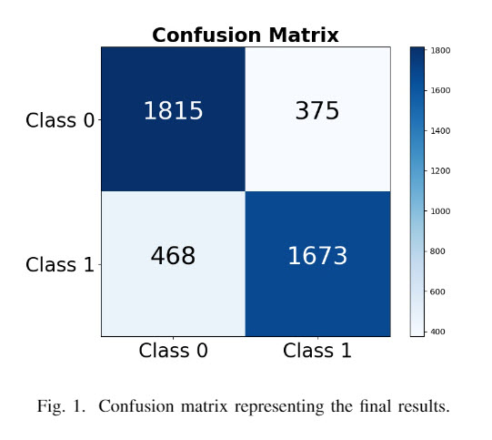

# Detection of Abusive Language in Online Comments

We  propose  a  supervised  learning  model  for the  solution  of  the  problem  of  detection  of  abusive  language in online comments. Our model makes use of traditional and problem specific features, and is based on a dataset of public Wikipedia comments.

## Dataset
We implemented our experiments using an abusive comments dataset made available by Wulczyn et al. in [1]. The corpus consists of over 100 000 comments gathered from Wikipedia, and labeled using crowd-sourcing. Every comment is labeled for abusiveness by at least 10, and up to 40 human labelers. To ensure the quality of the dataset, each of the labelers has gone through a process of pretesting.
The authors also make available additional 63 million comments, automatically labeled by the classifier proposed in their paper. These labels are as good as the aggregate of 3 crowd workers. 
%Including comments written by users banned by the Wikipedia administrators allowed for the amount of abusive comments to go up to 17\%.

As a preparation for further steps, the comments in the dataset were first pre-processed. This process consisted of removing strings specific for the dataset and contained within most of the comments (such as the new line token and specific character groups: "===", "::::", "***"). The comments were then processed using standard NLP techniques: punctuation was removed, upper casing was transformed into lower casing, all comments were tokenized, and empty comments were removed.

## Methodology
The feature set we experiment with and propose consists of standard NLP features as well as problem specific features. These include: word embeddings, n-grams, lexicons, sentiment polarity, statistical data, linguistic features, and offensiveness score.

## Experiments
A small part of the experiments performed within this research was with the goal of discovering the best way to balance the imbalanced dataset. The lion's share of the experiments, however, was done with the purpose of determining the best combination of features for the task of detecting abusive language.

### Class imbalance
Approximately 12% of the data samples in the dataset we use for our experiments are comments which contain abusive language. This scale of imbalance within the data can skew the results towards the more dominant class (the negative class in our case). The method we used in order to deal with this problem was twofold. In the first set of experiments we tried increasing the number of classes within the data, essentially creating more levels of abusiveness in the comments. We conducted these experiments using all the proposed features, excluding the General Inquirer lexicons, and Linear discriminant analysis as a classifier. The number of classes used in the initial experiments were 2, 3 and 6. The increase in classes did not provide any improvement of the classification results, as is shown in Table 1. Henceforth, we use the dataset with 2 classes. Next, we attempted to balance the two classes by using the same amount of data for both classes. The results of this set of experiments is also shown in Table 1. This method improved the classification results and for the rest of our experiments we use the two class balanced dataset.

### Feature selection
Next, we perform experiments towards determining the best features for this problem. The intial experiment towards this goal consists of testing the performance of every feature on its own. The features tested were: word embeddings (WE), sentiment polarity, readability, and subjectivity socres (PRSS), POS tags (POS), n-grams, offensiveness score (OS), linguistic features (LF), and General Inquirer (GI). Table 3 shows that word embeddings provide the best results, and  sentiment polarity, readability, and subjectivity scores and the General Inquirer lexicons show results barely better than random guesses. These results were used as a starting point in finding the best combination of features for the problem.

We built the next experiments by creating combinations of the already tested features, starting with the best performing and iteratively adding the worse. We experimented with 4 different models in order to find the best combination of features, those are the following:
* Model 1: Word embeddings, n-grams, and offensiveness score
* Model 2: Word embeddings, n-grams, offensiveness score, and POS tags
* Model 3: Word embeddings, n-grams, offensiveness score, POS tags, linguistic features, sentiment polarity, readability and subjectivity scores
* Model 4: Word embeddings, n-grams, offensiveness score, POS tags, linguistic features, sentiment polarity, readability and subjectivity scores, and the General Inquirer

The results of these experiments are shown in Table 3. These experiments were performed using the Logistic regression classifier. As we can see the best performing is Model 1.

### Classifier selection
The classifier selection experiments used the features from Model 1 which showed the best results in the previous experiments. The classifiers tested were: logistic regression, linear discriminant analysis, decision trees, naive Bayes classifier, random forest classifier, and extra trees classifier. It is clear from the results, shown in Table 4, that the best performing classifier is logistic regression. 

## Evaluation
The best results obtained in our research use the dataset with two balanced classes, word embeddings, n-grams and offensiveness score, and the logistic regression classifier. The F1 score of our best model is 0.8 and the ROC AUC 0.89.

\
As we can see from the confusion matrix, the model predicts the negative class slightly more than the positive class. However, the results are comparable to the state-of-the-art in the supervised learning solution of this problem, and generalise well to unseen comments.  

[1]: E.  Wulczyn,  N.  Thain,  and  L.  Dixon,  “Ex  machina:  Personal  attacksseen at scale,” inProceedings of the 26th International Conference onWorld Wide Web.   International World Wide Web Conferences SteeringCommittee, 2017, pp. 1391–1399